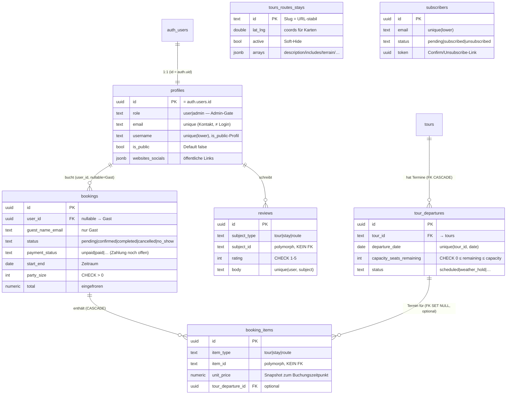

# HIKE Scotland (Next.js) — Architektur-Report

> **Was das ist:** Eine erklärende Landkarte der Codebasis — wie die App gebaut
> ist, wie ein Request durchfließt, wo die Daten liegen, was robust ist und wo
> die Schwächen sitzen. Gedacht zum **Verstehen und Lernen**, nicht nur zum
> Nachschlagen. Ergänzt die `CLAUDE.md` (technische Leitplanken) und
> [`supabase/README.md`](../supabase/README.md) (DB-Betrieb) um die *innere*
> Architektur der App-Schicht.
>
> 🗺 **Interaktiver Graph dazu:** `architektur.local.html` (lokal, **nicht im Repo** — enthält Security-Notizen) — im Browser
> öffnen (Pan/Zoom, klickbare Knoten mit Datei:Zeile + Security-Notizen, View-Filter
> für Buchungs-/Auth-/Admin-Flow).
> Stand: 2026-06-15. Analysierter Code-Stand: Juni 2026.
>
> **Geschwister-Projekt:** [`HIKE_SCOTLAND_NU`](../../HIKE_SCOTLAND_NU/docs/ARCHITEKTUR.md)
> ist die Uni-Variante (Vanilla PHP/MySQL). Dieser Report ist bewusst parallel
> aufgebaut — die beiden Maps zusammen sind das „Uni vs. Vibecoding"-Anschauungs-
> material.

---

## 1. Überblick (TL;DR)

HIKE Scotland (Next.js) ist eine **server-first gerenderte React-Anwendung** rund
ums Wandern in Schottland: Marketing-Seiten, ein Trip-Planner (Quiz +
„My Trip"-Itinerary), ein race-sicherer Buchungs-Flow, Newsletter, Google-Login
mit öffentlichen Nutzerprofilen und ein vollständiges Admin-Dashboard. Backend ist
**Supabase** (PostgreSQL + Auth + Storage); gehostet auf **Vercel** mit Auto-Deploy.

**Das mentale Modell in einem Satz:** Next.js rendert auf dem Server (React Server
Components), spricht über **vier klar getrennte Supabase-Clients** mit der DB —
drei mit dem öffentlichen `anon`-Key (durch Row-Level-Security abgesichert), einer
mit dem `service_role`-Key (umgeht RLS, nur serverseitig) — und die DB selbst
erzwingt Integrität und die heikle Buchungs-Logik über RLS-Policies und
`SECURITY DEFINER`-Funktionen.

| | |
|---|---|
| **Stil** | Next.js 14 App Router, server-first (RSC + Route Handlers + Server Actions), kein eigenes API-Framework, kein ORM |
| **Sprache/Runtime** | TypeScript, React 18, Node (Vercel Serverless/Edge) |
| **Datenbank** | Supabase / PostgreSQL — Zugriff über `@supabase/supabase-js` + `@supabase/ssr`, **generierte Typen** statt ORM |
| **Auth** | Supabase Auth, **Google OAuth** (kein Passwort), cookie-basierte Session; Rolle in `profiles.role` |
| **Externe Laufzeit-Dienste** | Supabase (eu-central-1), OpenStreetMap-Tiles (kein Key), Umami-Analytics. **Google Fonts self-hosted** (kein Drittanbieter-Request) |
| **Größe** | ~13.300 Zeilen TS/TSX · ~60 Seiten/Routes · 17 Supabase-Migrationen |
| **Sicherheits-Reife** | Hoch — RLS durchgängig, race-sichere Buchung, Secret-Trennung sauber; offene Punkte sind Härtung (Abschnitt 8) |

> ⚠️ **Veraltete Quelle:** Die lokale `CLAUDE_CODE_BRIEF.md` behauptet noch „Kein
> Backend, keine DB. Alle Inhalte statisch in `data/*.ts`". Das stimmt **nicht mehr** —
> Katalog, Buchungen, Newsletter, Auth und Profile liegen in Supabase. `data/*.ts`
> hält nur noch `destinations`, `imageCredits` und die App-`types`. Siehe W1.

---

## 2. Architektur in einem Bild

```
 BROWSER (React 18)                                  ┌─ OpenStreetMap-Tiles (Karten)
   │  Provider-Kette: Auth · Catalog · Trip          ├─ Umami (Analytics, afterInteractive)
   │  Trip-State in localStorage                     └─ Google Fonts → SELF-HOSTED (next/font)
   ▼
 MIDDLEWARE  (middleware.ts, läuft vor jeder Route)
   │  ① Session-Refresh (Cookies)   ② Gates: /account → Login · /admin → role='admin' (sonst 404)
   ▼
 NEXT-SERVER  (Vercel)
 ┌──────────────────────────────────────────────────────────────────────────┐
 │  SEITEN (RSC, viele mit ISR)   ·   ROUTE HANDLERS /api/*   ·  SERVER ACTIONS │
 │                                                                            │
 │           └──────────────┬───────────────┬───────────────┐                 │
 │                          ▼               ▼               ▼                 │
 │   lib/supabase.ts   lib/supabase/    lib/supabase/   lib/supabase-admin.ts  │
 │   (anon, public)    server.ts        client.ts       (service_role!)        │
 │                     (anon+Cookie     (Browser-Auth)   umgeht RLS            │
 │                      → auth.uid())                    nur serverseitig      │
 └───────────┬──────────────┬───────────────────────────────┬────────────────┘
             │ public-read   │ RLS (eigene Zeilen)           │ voller Zugriff
             ▼               ▼                               ▼
 SUPABASE / PostgreSQL  (Projekt-Ref bmcukaibgfvmvfqlmzwv · eu-central-1)
   Tabellen: tours·routes·stays · tour_departures · bookings·booking_items ·
             reviews · profiles(1:1 auth.users) · subscribers
   Views:    public_profiles · public_profile_trips · public_reviews
   Funktionen (SECURITY DEFINER): create_booking() [advisory-lock, race-safe] ·
             check_booking_availability() · handle_new_user() [Signup-Trigger]
   + Storage-Bucket: avatars (public-read)   + Auth: Google OAuth
```

**Fünf Schichten** (im interaktiven Graph als fünf Spalten):

1. **Client** — Browser, React-Provider (`AuthProvider`/`CatalogProvider`/`TripProvider`),
   Leaflet-Karten (nur client-seitig), Trip-State in `localStorage`.
2. **Edge/Middleware** — `middleware.ts` frischt die Session auf und bewacht
   `/account*` und `/admin*`.
3. **Seiten & Endpoints** — RSC-Seiten (Marketing/funktional/geschützt), `/api/*`-Route-
   Handlers, Server Actions.
4. **lib-Zugriffsschicht** — die vier Supabase-Clients + die Daten-Layer-Module
   (`catalog`, `bookings`, `availability`, `profile`, `reviews`, `admin/*`).
5. **Supabase** — Tabellen, Views, `SECURITY DEFINER`-Funktionen, Auth, Storage.

---

## 3. Die Bausteine (Modul für Modul)

### 3.1 Entry & Middleware
- **[`middleware.ts`](../middleware.ts)** — der einzige zentrale „Türsteher". Läuft
  über den `matcher` ([Z. 41-46](../middleware.ts)) auf allen Routen außer statischen
  Assets. Tut zwei Dinge: (a) **Session-Refresh** via `updateSession`
  ([`lib/supabase/middleware.ts`](../lib/supabase/middleware.ts)), (b) **Gates**:
  `/account*` ohne Login → Redirect auf `/` ([Z. 16-24](../middleware.ts)); `/admin*`
  ohne Admin-Rolle → **404** (kein Info-Leak, ersetzt das alte `ADMIN_ENABLED`-Gate,
  [Z. 26-36](../middleware.ts)).
- **[`app/layout.tsx`](../app/layout.tsx)** — Root-Layout. Verschachtelt die
  Provider-Kette `AuthProvider → CatalogProvider → TripProvider` ([Z. 86-101](../app/layout.tsx)),
  hängt `Navbar`/`Footer`/`NewsletterBand` ein (per `HideOnAdmin` im Admin ausgeblendet),
  lädt Fonts **self-hosted** via `next/font` ([Z. 14-28](../app/layout.tsx)) und das
  Umami-Script ([Z. 102-106](../app/layout.tsx)).

### 3.2 Die vier Supabase-Clients (das Herz der Security-Story)
Der gesamte DB-Zugriff geht über genau vier Clients — die Trennung ist die zentrale
Sicherheits-Entscheidung des Projekts:

| Client | Datei | Key | Wofür | Sicherheit |
|---|---|---|---|---|
| **anon (public)** | [`lib/supabase.ts`](../lib/supabase.ts) | `anon` | Public-Reads ohne Login: Katalog, Verfügbarkeit. Eigener Storage-Key (`sb-hike-catalog-anon`), Auth aus | durch RLS abgesichert; bewusst sessionslos |
| **anon + Cookie (RLS)** | [`lib/supabase/server.ts`](../lib/supabase/server.ts) | `anon` | RSC/Actions/Route-Handler mit Login-Kontext — liest die Session aus Cookies, damit `auth.uid()` in RLS greift | RLS „read/write own" |
| **Browser-Auth** | [`lib/supabase/client.ts`](../lib/supabase/client.ts) | `anon` | Browser-Singleton für Login/Logout/`onAuthStateChange`; teilt die Session-Cookies | ein GoTrueClient pro Storage-Key |
| **service_role** | [`lib/supabase-admin.ts`](../lib/supabase-admin.ts) | **`service_role`** | Umgeht RLS — Admin-Writes, Newsletter, Avatar-Upload, `create_booking`-Aufruf | **nur serverseitig**, kein `NEXT_PUBLIC_`-Prefix → nie im Browser-Bundle |

> **Warum vier?** `anon` vs. `service_role` ist die RLS-Grenze. Innerhalb von `anon`
> trennt das Projekt sauber: cookie-los für öffentliche Reads ([`lib/supabase.ts`](../lib/supabase.ts),
> verhindert eine zweite GoTrue-Instanz unter demselben Storage-Key) vs.
> cookie-bewusst für Login-Kontext ([`server.ts`](../lib/supabase/server.ts)/[`client.ts`](../lib/supabase/client.ts)).
> Alle Clients sind **lazy/singleton**, damit der Build nicht bricht, wenn zur
> Build-Zeit Env-Variablen fehlen ([`lib/supabase.ts` Z. 8-20](../lib/supabase.ts)).

### 3.3 Daten-Zugriffsschicht (`lib/`)
Dünne, typisierte Module über den Clients — kein ORM, sondern direkte Queries plus
ein Mapping DB (snake_case/jsonb) ↔ App-Typen (camelCase, `coords{lat,lng}`):

| Modul | Zweck | Client |
|---|---|---|
| [`lib/catalog.ts`](../lib/catalog.ts) | Server-Reads `getTours/Routes/Stays(+ById)` + `getTourDepartures`, mappt auf `data/types.ts` | anon |
| [`lib/catalog-client.tsx`](../lib/catalog-client.tsx) | `CatalogProvider`/`useCatalog` — lädt Katalog einmal client-seitig (Karten, Quiz, My-Trip) | anon |
| [`lib/availability.ts`](../lib/availability.ts) | `checkBookingAvailability()` → RPC `check_booking_availability` (nur `{ok, reasons}`) | anon |
| [`lib/bookings.ts`](../lib/bookings.ts) | `createBooking()` — `fetch` auf `POST /api/bookings` (clientseitiger Wrapper) | — (HTTP) |
| [`lib/profile.ts`](../lib/profile.ts) | Username-Regeln/Reserved-Liste, Social-URL-Bau, Normalisierung | — |
| [`lib/reviews.ts`](../lib/reviews.ts) / [`reviews-actions.ts`](../lib/reviews-actions.ts) | Reviews lesen (View) / `submitReview` (Server Action) | anon / server |
| [`lib/admin/queries.ts`](../lib/admin/queries.ts) · [`catalog.ts`](../lib/admin/catalog.ts) | Admin-Reads/Writes (KPIs, Buchungen, Katalog) | service_role |
| [`lib/recommend.ts`](../lib/recommend.ts) · [`mapPoints.ts`](../lib/mapPoints.ts) · [`trip.tsx`](../lib/trip.tsx) | Reine Funktionen / Client-State (Quiz-Scoring, Karten-Punkte, Trip-Context+localStorage) | — |

### 3.4 Seiten & Endpoints (`app/`)
**Marketing (dunkel/cineastisch, statisch/ISR):** `/` ([page.tsx](../app/page.tsx)),
`/destinations(+/[slug])`. **Öffentliches Profil** `/profiles/[username]` ist
ebenfalls dunkel, liest aber die View `public_profiles` über den anon-Client.

**Funktional (hell, ISR `revalidate=300`):** `/routes` · `/tours` · `/stays`
(Browse mit Sticky-Karte) + Detailseiten `…/[id]` (Reviews, Buchen-Button,
`opengraph-image`). **Client-lastig:** `/plan` (Quiz, braucht `<Suspense>` für
`useSearchParams`) und `/my-trip` (Itinerary → Buchung).

**Geschützt (Middleware-Gate):** `/account*` (Self-Service: Kontaktdaten, Newsletter-
Toggle, öffentliches Profil, eigene Buchungen) · `/admin*` (Dashboard, Buchungen,
Katalog-CRUD, Profile/Rollen, Newsletter — alles über `service_role`).

**Endpoints:** `POST /api/bookings` ([route.ts](../app/api/bookings/route.ts)),
`POST /api/newsletter/{subscribe,unsubscribe}`, OAuth-Callback
`/auth/callback` ([route.ts](../app/auth/callback/route.ts)). **Server Actions**
liegen je Feature in `actions.ts` (account, admin/*, reviews).

---

## 4. Datenfluss — vier Szenarien

### Szenario A — Katalog-Seite anonym (z. B. `/routes`, ISR)
```
Browser → Middleware (Session-Refresh, kein Gate)
   → RSC /routes  → lib/catalog.getRoutes()
       → lib/supabase.ts (anon, cookie-los)
       → SELECT * FROM routes WHERE active = true      ← RLS: "public read" (using true)
   → HTML (alle 300 s neu gerendert, ISR) + clientseitige Leaflet-Karte
```
> Inhalts-Edits im `/admin`-Katalog erscheinen ohne Deploy nach ≤5 min (ISR).

### Szenario B — Google-Login (OAuth)
```
Browser → AuthProvider.signInWithGoogle()  → Supabase Auth → Google
   ← Redirect /auth/callback?code=…  → exchangeCodeForSession (Cookie gesetzt)
       └ Open-Redirect-Schutz: nur interne Pfade erlaubt   (auth/callback/route.ts)
   ↳ DB-Trigger on_auth_user_created → handle_new_user() (SECURITY DEFINER)
        legt profiles-Zeile an (role='user', Avatar aus Google-Meta), ON CONFLICT DO NOTHING
   → Middleware hält Session ab jetzt bei jedem Request frisch
```

### Szenario C — Buchung (`POST /api/bookings`, race-sicher)
```
/my-trip (BookingPanel) → lib/bookings.createBooking() → POST /api/bookings
   ├─ validiere: items nicht leer, Datum, partySize           (route.ts Z. 25-31)
   ├─ Login?  → JA: Name/E-Mail server-seitig aus profiles/Auth ableiten,
   │                 Client-Werte werden IGNORIERT             (route.ts Z. 44-52)
   │            NEIN (Gast): Name + E-Mail-Regex prüfen        (route.ts Z. 53-60)
   ├─ admin.rpc("create_booking", …)  [service_role]          (route.ts Z. 61-68)
   │     └─ DB: pg_advisory_xact_lock  →  Verfügbarkeit ERNEUT prüfen
   │            →  Preise einfrieren  →  INSERT bookings + booking_items
   │            (alles in EINER Transaktion, SECURITY DEFINER, search_path='')
   └─ bei Login: Buchung mit user_id verknüpfen               (route.ts Z. 77-82)
```
> **Stark:** Preise und Kontaktdaten kommen serverseitig aus DB/Session/Auth, **nie**
> ungeprüft aus dem Formular. Die eigentliche Race-Sicherheit (Doppelbuchung der
> letzten Kapazität) wird **in der DB** über Advisory-Lock + Re-Check erzwungen — der
> Vorab-Check in `/plan` ist nur UX.

### Szenario D — Admin-Mutation (z. B. Rolle ändern)
```
Browser → Middleware: /admin* → role='admin'? sonst 404
   → app/admin/layout.tsx prüft die Rolle ERNEUT (Defense-in-Depth)
   → Server Action updateProfileRole (admin/profiles/actions.ts)
       ├─ Self-Lock: Admin kann sich NICHT selbst herabstufen (Z. 25)
       ├─ getSupabaseAdmin() [service_role] → UPDATE profiles.role
       └─ revalidatePath("/admin/profiles")
```

---

## 5. Datenmodell (Supabase / PostgreSQL)



**Beobachtungen:**
- **Katalog in der DB:** `tours`/`routes`/`stays` haben **Slug-`id`** (= alte
  `data/*.ts`-IDs → URLs bleiben stabil), Arrays als `jsonb`, `coords` als `lat`/`lng`,
  `active` für Soft-Hide. Migration `…catalog_tables.sql`.
- **Buchung als Snapshot:** `booking_items` friert `title`/`unit_price`/`line_total`
  zum Buchungszeitpunkt ein (Preisänderungen im Katalog verändern alte Buchungen nicht).
- **Polymorphe IDs ohne FK:** `booking_items.item_id` und `reviews.subject_id` zeigen
  je nach `*_type` auf tours, routes **oder** stays — ein einzelner FK ist nicht
  möglich. Integrität dieser Verweise liegt im App-Code (vgl. W4).
- **`profiles` ↔ `auth.users` 1:1**, automatisch per Trigger befüllt. `profiles.email`
  ist eine **separate** Kontakt-E-Mail, nicht die (unveränderliche) Google-Login-Adresse.
- **`subscribers` steht bewusst ohne Beziehung** — Newsletter braucht kein Login.
- **Kapazitäts-Modell:** `tour_departures.seats_remaining` existiert, wird aber
  **nicht** als harte Buchungsgrenze durchgesetzt — das gewählte Modell ist
  „**max. 5 gleichzeitige Buchungen**" plus Stay-Personen-Kapazität (siehe 8/W5).

---

## 6. Abhängigkeiten

| Ebene | Was | Bewertung |
|---|---|---|
| Runtime-npm | `next`, `react`, `react-dom`, `@supabase/{ssr,supabase-js}`, `leaflet`, `react-leaflet`, `lucide-react` | schlank (8 Pakete) ✅ |
| Pinning | `react-leaflet@4` **an React 18 gepinnt** — v5 verlangt React 19 | bewusst, **nicht upgraden** ⚠️ |
| Backend | **Supabase** (PostgreSQL/Auth/Storage), Region eu-central-1 | DSGVO-freundliche Region ✅ |
| Karten | **OpenStreetMap**-Tiles via Leaflet — **kein API-Key/Secret** | minimale Angriffsfläche ✅ |
| Analytics | **Umami** (`cloud.umami.is`, `afterInteractive`) | Drittanbieter-Request je Seite → CSP/DSGVO im Blick behalten ⚠️ |
| Fonts | Josefin Sans + Lato via `next/font` → **self-hosted** (`.woff2`) | **kein** Google-Fonts-Request (besser als die PHP-Variante!) ✅ |
| Build | `sharp` (Bildoptimierung, Avatar-Resize) — devDependency | Standard ✅ |
| Hosting | **Vercel**, Auto-Deploy bei Push auf `main` | erst bauen, dann pushen ⚠️ |
| Secrets | `NEXT_PUBLIC_SUPABASE_{URL,ANON_KEY}` (öffentlich, RLS), `SUPABASE_SERVICE_ROLE_KEY` (geheim, serverseitig) | saubere Trennung ✅ |

> Für das BRAIN-**Bausteine-Register**: einziger geheimer Schlüssel ist der
> `service_role`-Key (nur serverseitig); die externen Laufzeit-Requests sind
> Supabase, OSM-Tiles und Umami. Google Fonts ist **kein** externer Request.

---

## 7.–8. Wartbarkeit & Security-Befunde

> 🔒 Ausgelagert nach `docs/ARCHITEKTUR.local.md` (gitignored, nicht im Repo) — die
> konkreten strukturellen Schwächen und priorisierten Security-Befunde stehen bewusst
> nicht im öffentlichen Repo. Lokal nachlesen.

---

## 9. Was das Projekt richtig macht (bewusst hervorgehoben)

Die Sicherheits-Grundlinie ist **hoch** — wichtig für die Einordnung „mit Claude Code
vibe-gecoded ≠ unsicher":

- ✅ **RLS auf allen Tabellen aktiv**, mit `auth.uid()`-Checks auf allen Nutzerdaten
  (`profiles`, `bookings`, `booking_items` via verschachteltem Check, `reviews`).
- ✅ **Secret-Trennung sauber:** `service_role`-Key hat keinen `NEXT_PUBLIC_`-Prefix,
  landet nie im Browser-Bundle, wird nur in Route-Handlers/Server-Actions benutzt.
- ✅ **Race-sichere Buchung in der DB:** `create_booking()` mit `pg_advisory_xact_lock`
  + erneutem Verfügbarkeits-Check + atomarem Insert in einer Transaktion — der Klassiker
  „letzte zwei Plätze doppelt verkauft" ist strukturell abgewehrt. Nur via `service_role`
  aufrufbar.
- ✅ **`SECURITY DEFINER`-Funktionen mit `search_path=''` gehärtet** (`create_booking`,
  `check_booking_availability`, `set_updated_at`, `handle_new_user`) — schließt
  Schema-Hijacking.
- ✅ **Preise & Kontaktdaten serverseitig:** beim Buchen aus DB/Session/Auth, Client-
  Werte für eingeloggte Nutzer ignoriert — kein „Preis im Hidden-Field manipulieren".
- ✅ **Views statt RLS-Lockerung** für öffentliche Profile/Reviews — exponieren nur
  unbedenkliche Spalten; E-Mail/Telefon/Adresse/Rolle bleiben unerreichbar.
- ✅ **Open-Redirect-Schutz** an beiden offenen Weiterleitungen: OAuth-Callback
  ([`auth/callback/route.ts`](../app/auth/callback/route.ts)) und `submitReview`
  ([`lib/reviews-actions.ts`](../lib/reviews-actions.ts)) erlauben nur interne Whitelist-Pfade.
- ✅ **Admin echt geschützt:** Google-Login + `profiles.role='admin'`, `/admin*` → 404
  bei Nicht-Admin (kein Existenz-Leak), plus Selbstsperre-Schutz und zweiter Rollen-
  Check im Layout.
- ✅ **Newsletter-PII geschützt:** RLS aktiv ohne offene Policy (nur `service_role`),
  Ausnahme nur „eigene Zeile per E-Mail lesen".
- ✅ **Google Fonts self-hosted** via `next/font` — kein Drittanbieter-Request, anders
  als bei vielen Standard-Setups.

---

## 10. Anhang — Knoten/Kanten für die interaktive Map

Vorlage für [`architektur.local.html`](architektur.local.html). Knotentypen wie im Geschwister-
Report, erweitert um die fünfte Schicht (Externe Dienste):

| Farbe | Typ | Knoten in diesem Projekt |
|---|---|---|
| 🔵 Client | Browser/Edge | `browser`, `middleware` (Session + Gates) |
| 🟢 Seite/Endpoint | RSC-Seite, Route-Handler, Server Action | Marketing, Browse/Detail, `/plan`+`/my-trip`, `/api/bookings`, `/api/newsletter/*`, `/auth/callback`, `/account*`, `/admin*` |
| ⚪ Statisch | dunkle Marketing-Seite | `/`, `/destinations`, `/profiles/[username]` |
| 🟣 Service | lib-Schicht | 4 Supabase-Clients, `catalog`, `bookings`/`availability`, `admin/*`, Provider |
| 🟧 DB | Supabase-Tabelle/View/Funktion | `tours/routes/stays`, `tour_departures`, `bookings/booking_items`, `reviews`, `profiles`, `subscribers`, Views, `create_booking`, `check_booking_availability`, `handle_new_user` |
| 🔴 Extern | Drittdienst | Supabase Auth/Storage, OpenStreetMap, Umami |

**Kern-Kanten (Datenfluss):**
- `browser` → `middleware` → alle Seiten (Gate-Kanten zu `/account*`, `/admin*`)
- Katalog: Marketing/Browse → `lib/catalog` → `anon-Client` → `tours/routes/stays` (read)
- Buchung: `/my-trip` → `/api/bookings` → `service_role` → `create_booking` → `bookings`/`booking_items` (write), liest `tour_departures`/Katalog
- Auth: `browser` → `Browser-Client` → Supabase Auth; Signup → `handle_new_user` → `profiles` (write)
- Account/Admin: `/account*` → `server-Client` (RLS) → eigene Buchungen/Profil; `/admin*` → `service_role` → alle Tabellen
- Extern: `browser` → OSM-Tiles, Umami; alle Clients → Supabase

---

*Erstellt 2026-06-15 als Teil der BRAIN-Code-Maps (Gegenstück zu HIKE_SCOTLAND_NU).
Aktualisieren, wenn sich die Architektur ändert (neue Tabellen, Endpoints, externe
Dienste, Auth-/RLS-Änderungen). Pflege über `/log` (Projekt-Karte) mitführen.*
