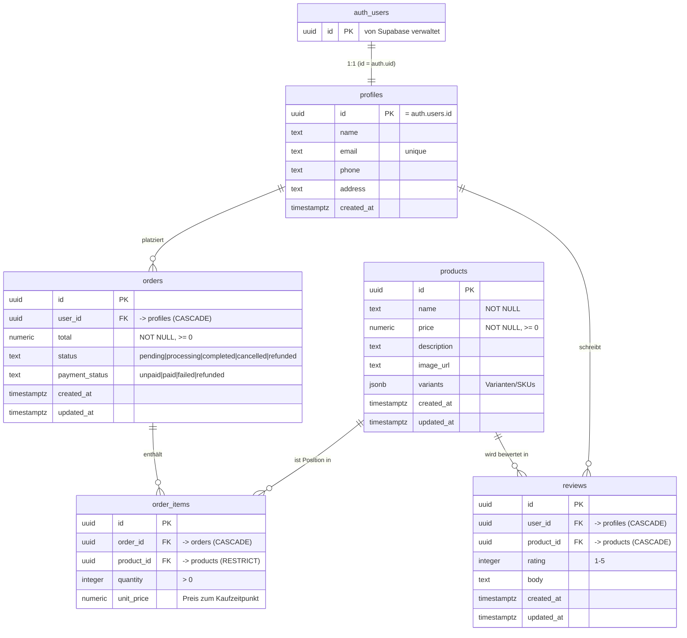

# Datenbank — Setup & Pflege

Supabase (PostgreSQL) für HIKE_SCOTLAND. Diese Datei beschreibt **einmaliges
Setup**, **laufende Pflege** und **Notfälle** (Backup/Restore).

> Schema-Quelle der Wahrheit: die SQL-Dateien in `supabase/migrations/`.
> **Nie** das Schema im Dashboard von Hand ändern — immer über eine Migration
> (siehe „Schema ändern").

> Live-Projekt: `hike-scotland` · Ref `bmcukaibgfvmvfqlmzwv` · Region eu-central-1

---

## 0. ER-Diagramm



> Lesehilfe: `||--o{` = „eins zu null-oder-viele". `auth_users` ist die von
> Supabase verwaltete Login-Tabelle (`auth.users`); `profiles` hängt 1:1 daran.

---

## 1. Voraussetzungen (einmalig)

| Was | Befehl / Quelle |
|---|---|
| Supabase-Account | <https://supabase.com> (Free-Tier reicht) |
| Supabase CLI | `npm install -g supabase` (oder `npx supabase ...`) |
| Login der CLI | `npx supabase login` |

Lokal ist kein Docker nötig, solange du gegen die Cloud-DB arbeitest.

---

## 2. Erst-Setup (einmal pro Projekt)

### 2.1 Supabase-Projekt anlegen
Im Dashboard ein Projekt erstellen → **Region EU** (z. B. Frankfurt) wegen DSGVO.
Das **Datenbank-Passwort** sicher ablegen (z. B. im Passwortmanager) — es wird
für Restores gebraucht.

### 2.2 CLI mit dem Projekt verbinden
```bash
cd <projekt-root>
npx supabase link --project-ref <project-ref>   # ref steht im Dashboard-URL
```

### 2.3 Migrationen einspielen
```bash
npx supabase db push      # spielt alle Dateien aus supabase/migrations/ ein
```
Damit entstehen die Tabellen `profiles, products, orders, order_items, reviews`
inkl. RLS, Indizes und den 5 Seed-Produkten.

### 2.4 Umgebungsvariablen für Next.js
Im Dashboard unter **Project Settings → API** holen und in `.env.local` legen
(diese Datei ist gitignored und gehört **nicht** ins Repo):

```bash
NEXT_PUBLIC_SUPABASE_URL=https://<ref>.supabase.co
NEXT_PUBLIC_SUPABASE_ANON_KEY=<anon-key>      # öffentlich, nur mit RLS sicher
SUPABASE_SERVICE_ROLE_KEY=<service-role-key>  # GEHEIM, nur serverseitig!
```

> ⚠️ Der **service_role**-Key umgeht RLS komplett. Niemals in Client-Code, nie
> mit `NEXT_PUBLIC_` prefixen, nie committen. Nur in Server Components / Route
> Handlers / Server Actions verwenden.

---

## 3. Schema ändern (laufende Entwicklung)

Immer als **neue** Migration, nie bestehende Dateien editieren (die sind schon
eingespielt).

```bash
# 1. Neue, leere Migrationsdatei anlegen
npx supabase migration new <beschreibender_name>   # z.B. add_bookings

# 2. SQL in die erzeugte Datei in supabase/migrations/ schreiben

# 3. Lokal/Cloud einspielen
npx supabase db push

# 4. Committen (Migrationen IMMER ins Git)
git add supabase/migrations/ && git commit -m "db: <was geändert wurde>"
```

Regeln:
- Jede Änderung = eigene Migration mit Zeitstempel-Präfix (chronologisch).
- Migrationen sind **additiv**: keine alte Datei nachträglich ändern.
- Nach Schemaänderung TypeScript-Typen neu generieren (siehe 4).

---

## 4. TypeScript-Typen generieren

Nach jeder Schemaänderung, damit der App-Code typsicher bleibt:

```bash
npx supabase gen types typescript --project-id <ref> > types/database.types.ts
```

Verwendung im Code: `createClient<Database>(...)` (Stack-B-Muster, ohne ORM).

---

## 5. Seed-Daten

- Aktuell stehen 5 Beispiel-Produkte direkt in der Init-Migration (feste UUIDs,
  `ON CONFLICT DO NOTHING` → mehrfaches Einspielen schadet nicht).
- Für umfangreichere Testdaten: `supabase/seed.sql` anlegen — die wird bei
  `supabase db reset` automatisch nach den Migrationen ausgeführt.

```bash
npx supabase db reset   # ⚠️ LÖSCHT alle Daten, spielt Migrationen + seed.sql neu ein
```
`db reset` nur in Entwicklung/Staging — **nie** gegen Produktion.

---

## 6. Backup & Restore

### Backup
- **Automatisch:** Supabase macht tägliche Backups (Free-Tier: begrenzte
  Aufbewahrung; bezahlte Pläne: Point-in-Time-Recovery).
- **Manuell (empfohlen vor größeren Migrationen):**
```bash
npx supabase db dump -f backup_$(date +%F).sql            # Schema + Daten
npx supabase db dump --data-only -f data_$(date +%F).sql  # nur Daten
```
Den Dump außerhalb des Repos sichern (enthält ggf. echte Nutzerdaten → DSGVO).

### Restore
```bash
psql "<connection-string>" < backup_2026-06-05.sql
```
Connection-String steht im Dashboard unter **Project Settings → Database**.

---

## 7. Laufende Pflege / Monitoring

| Aufgabe | Wie | Rhythmus |
|---|---|---|
| Security-Check (RLS-Lücken etc.) | Dashboard → **Advisors → Security** | nach jeder Migration |
| Performance-Check (fehlende Indizes, langsame Queries) | Dashboard → **Advisors → Performance** | monatlich |
| Logs ansehen | Dashboard → **Logs** | bei Fehlern |
| DB-Größe / Auslastung | Dashboard → **Reports** | monatlich |
| Backup-Test (Restore probeweise) | siehe 6 | quartalsweise |

**RLS-Grundsatz:** Jede neue Tabelle bekommt sofort `ENABLE ROW LEVEL SECURITY`
+ mindestens eine Policy. Ohne Policy ist eine RLS-Tabelle für normale Nutzer
komplett gesperrt (nur service_role kommt rein) — das ist sicher, aber bewusst
zu prüfen.

---

## 8. Sicherheits-Checkliste

- [ ] RLS auf **allen** Tabellen aktiv
- [ ] `SUPABASE_SERVICE_ROLE_KEY` nur serverseitig, nie im Client/Repo
- [ ] `.env.local` in `.gitignore`
- [ ] Datenbank-Passwort im Passwortmanager
- [ ] Region EU (DSGVO)
- [ ] Advisors → Security nach jeder Migration grün

---

## 9. Troubleshooting

| Symptom | Ursache / Lösung |
|---|---|
| `permission denied for table ...` | RLS aktiv, aber keine passende Policy → Policy ergänzen oder serverseitig service_role nutzen |
| Query liefert leeres Ergebnis trotz Daten | RLS filtert weg (`auth.uid()` passt nicht) → eingeloggt? richtige user_id? |
| `db push` meldet „migration already applied" | normal — nur neue Migrationen werden eingespielt |
| Typfehler im App-Code nach Schemaänderung | Typen neu generieren (siehe 4) |
| Seed schlägt fehl mit „duplicate key" | bereits vorhanden — `ON CONFLICT DO NOTHING` greift, kein echter Fehler |

---

## 10. Verweise

- Schema-Detail (Tabellen, Spalten, Relationen): `supabase/migrations/20260604000000_init_shop.sql` (Kommentar-Header)
- Supabase Docs: <https://supabase.com/docs>
- RLS-Guide: <https://supabase.com/docs/guides/auth/row-level-security>
