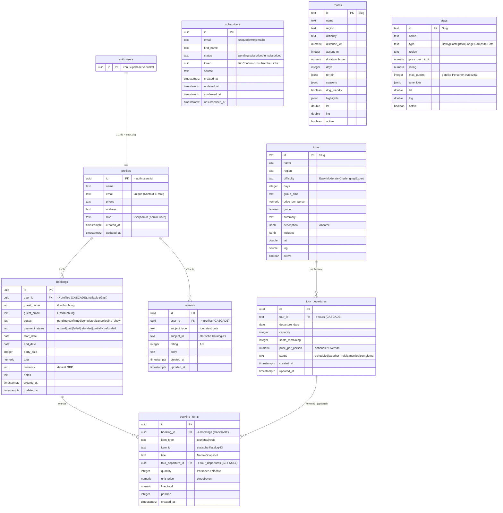

# Datenbank — Setup & Pflege

Supabase (PostgreSQL) für HIKE_SCOTLAND. Diese Datei beschreibt **einmaliges
Setup**, **laufende Pflege** und **Notfälle** (Backup/Restore).

> Schema-Quelle der Wahrheit: die SQL-Dateien in `supabase/migrations/`.
> **Nie** das Schema im Dashboard von Hand ändern — immer über eine Migration
> (siehe „Schema ändern").

> Live-Projekt: `hike-scotland` · Ref `bmcukaibgfvmvfqlmzwv` · Region eu-central-1

---

## 0. ER-Diagramm



> Lesehilfe: `||--o{` = „eins zu null-oder-viele". `auth_users` ist die von
> Supabase verwaltete Login-Tabelle (`auth.users`); `profiles` hängt 1:1 daran.
> `subscribers` steht bewusst **ohne** Beziehung — Newsletter braucht kein Login.
>
> **Katalog (`tours`/`routes`/`stays`) liegt in der DB** (Slug-`id` = bisherige
> data/*.ts-IDs, daher URL-stabil). `tour_departures.tour_id` ist ein echter FK
> auf `tours`. `booking_items.item_id` und `reviews.subject_id` bleiben **polymorphe
> Text-IDs ohne FK** (sie zeigen je nach `item_type`/`subject_type` auf tours, stays
> **oder** routes — ein einzelner FK ist da nicht möglich).

---

## Buchungsmodell (Touren)

Eine **selbst zusammengestellte Tour** wird beim Buchen als **Snapshot**
gespeichert (der „My Trip"-Planer bleibt clientseitig in localStorage):

- **`bookings`** — eine Buchung: Bucher (`user_id`), Zeitraum, `party_size`,
  `total`, Status-Maschinen (`status`, `payment_status`).
- **`booking_items`** — die Posten der Tour, **eingefroren**: `item_type`
  (tour|stay|route) + `item_id` (Katalog-ID) + `title`/`unit_price`/`line_total`
  zum Buchungszeitpunkt. Tour-Posten zeigen optional auf eine `tour_departure`.
- **`tour_departures`** — konkrete Abreisetermine je Tour (FK auf `tours`) mit
  `capacity` / `seats_remaining` (+ `weather_hold`-Status fürs schottische Wetter).
  Öffentlich lesbar; Schreiben nur via `service_role`.
- **`reviews`** — polymorph über `subject_type`/`subject_id` (Tour, Stay **oder**
  Route), eine Review pro Nutzer & Objekt.

**Buchung anlegen:** `create_booking(p_items, p_start, p_end, p_party_size,
p_guest_name, p_guest_email)` (`SECURITY DEFINER`, `pg_advisory_xact_lock`)
prüft die Verfügbarkeit **race-sicher erneut**, friert die Preise ein
(Tour = Preis × Personen, Stay = Preis/Nacht × Nächte, Route = 0) und legt
`bookings` + `booking_items` in **einer Transaktion** an. Nur via `service_role`
aufrufbar — Aufruf über die Route `POST /api/bookings` (`lib/bookings.ts` →
`createBooking`). **Kontaktdaten:** eingeloggte Nutzer geben **keine** Name/E-Mail
mehr ein — `POST /api/bookings` leitet sie server-seitig aus `profiles`/Auth ab
(Client-Werte werden ignoriert) und verknüpft die Buchung mit dem Konto (`user_id`);
**Gäste** liefern Name + E-Mail wie bisher, `user_id` bleibt null. Eigene Buchungen
sieht der User unter `/account/bookings` (RLS „read own"). UI:
`components/BookingPanel.tsx` in `/my-trip` (blendet die Kontaktfelder bei Login aus).

> ⚠️ **Noch offen:** Zahlungsanbindung. Sitzplatz-Abzug auf `tour_departures` ist
> bewusst **nicht** Teil der Durchsetzung — das gewählte Modell ist „max. 5
> gleichzeitig".

---

## Verfügbarkeit & Constraints

Geprüft über die SQL-Funktion
`check_booking_availability(p_items, p_start, p_end, p_party_size)` (RPC,
**`SECURITY DEFINER`** → darf alle Buchungen zählen, gibt aber nur
`{ ok, reasons }` zurück, keine fremden Daten). App-Wrapper:
`lib/availability.ts` → `checkBookingAvailability()`.

- **Begleitkapazität (Routes + Guided Tours):** **GLOBAL max. 5 gleichzeitig
  laufende Buchungen** (Datums-Überlappung), die einen Route-/Tour-Posten
  enthalten. Gezählt werden **Buchungen, nicht Personen** (5 Personen in einer
  Buchung = 1; 5 Einzelbuchungen = 5). Der Wert ist die Anbieter-/Begleitkapazität
  (Konstante `v_max_concurrent` in der Funktion — eine Stelle zum Ändern).
- **Stays:** geteilte Personen-Kapazität `stays.max_guests`. Summe der Personen
  überlappender Buchungen + neue Personenzahl ≤ `max_guests`, sonst `stay_full`.
- **Meldungen:** `reasons[]` mit `code` + deutscher `message` — `guides_full`,
  `stay_full`, `stay_unknown`, `invalid_dates`, `invalid_party`. Derzeit nur
  „nicht möglich"-Hinweis; Alternativvorschläge kommen später per AI.

> Die **Durchsetzung** beim Buchen passiert race-sicher in `create_booking()`
> (Advisory-Lock + erneuter Check in einer Transaktion) — siehe „Buchungsmodell".
> Der Advisor-WARN „anon darf SECURITY-DEFINER ausführen" betrifft nur den
> Vorab-Check `check_booking_availability` (kein Login, keine PII) und ist bewusst
> akzeptiert; `create_booking` ist ausschließlich via `service_role` aufrufbar.

---

## Katalog (`tours` / `routes` / `stays`)

Der Inhalts-Katalog liegt vollständig in der DB (früher statisch in `data/*.ts`).
`id` ist ein Slug (= bisherige IDs → URLs bleiben stabil), Arrays als `jsonb`,
`coords` als `lat`/`lng`, `active` für Soft-Hide. RLS: **public read**, Schreiben
nur via `service_role`.

**Zugriff im Code:**
- **Server** (Browse-/Detail-/Home-/Destination-Seiten): `lib/catalog.ts`
  (`getTours/getRoutes/getStays` + `*ById`) — mappt DB-Zeilen auf die App-Typen
  (`data/types.ts`). Seiten sind ISR (`revalidate = 300`) → Edits erscheinen ohne
  Deploy nach ≤5 Min.
- **Client** (Karten, `/plan`-Quiz, `/my-trip`): `lib/catalog-client.tsx`
  (`CatalogProvider` + `useCatalog`) lädt den Katalog einmal über den anon-Key und
  stellt id-Lookups bereit. `lib/mapPoints.ts` und `lib/recommend.ts` sind reine
  Funktionen über diese Daten.

> `data/types.ts` (App-Typen), `data/destinations.ts` und `data/imageCredits.ts`
> bleiben bewusst statisch — nur tours/routes/stays sind in die DB gewandert.

> **Pflege im Betrieb:** Katalog, Buchungen, Newsletter und Nutzer/Rollen werden
> über das interne Dashboard `/admin` bearbeitet (server-only via `service_role`,
> hinter echtem Google-Login + `profiles.role='admin'` — siehe „Auth / Login"
> unten und Projekt-`CLAUDE.md`). Schema-Änderungen weiterhin **nur** per Migration.

---

## Newsletter — Abonnenten (`subscribers`)

Eigene, **auth-unabhängige** Tabelle für Newsletter-Anmeldungen (Anmeldung ohne
Login möglich). Enthält PII (E-Mails) → **kein offener Lesezugriff**. RLS ist aktiv;
Schreiben läuft ausschließlich serverseitig über den `service_role`-Key. **Einzige
Lese-Policy:** „read own by email" — eingeloggte User dürfen **genau ihre eigene**
Zeile lesen (Match `lower(email) = auth.jwt()->>'email'`), nötig für die
Status-Anzeige im Konto und im Newsletter-Banner. Migration:
`supabase/migrations/20260607010000_subscribers_read_own.sql`.

**Self-Service:** Eingeloggte User schalten ihr Abo unter `/account` an/aus
(`setNewsletter` in `app/account/actions.ts`, service_role). Der globale Banner
(`components/NewsletterBand.tsx`) blendet sich für Admins, bereits Abonnierte und
auf `/account*`/`/newsletter` aus.

- **Spalten:** `id · email · first_name · status (pending|subscribed|unsubscribed) · token · source · created_at · updated_at · confirmed_at · unsubscribed_at`. E-Mail case-insensitive eindeutig (`unique index on lower(email)`); jeder Abonnent hat einen geheimen `token` für Confirm-/Unsubscribe-Links.
- **Aktueller Modus:** *ohne* Double Opt-in — Anmeldung setzt direkt `status='subscribed'`. Schema unterstützt Double Opt-in über `pending` + Confirm-Route; für DE/EU-Marketing **vor echtem Versand nachrüsten**.

**Routen (App):**

| Route | Zweck |
|---|---|
| `POST /api/newsletter/subscribe` | Anmeldung (`{email, firstName?, source?}`); reaktiviert Abgemeldete, idempotent |
| `POST /api/newsletter/unsubscribe` | Abmeldung per `{token}` |
| `/unsubscribe?token=…` | Abmelde-Seite mit Bestätigungs-Button (schützt vor Link-Prefetch) |

**Unsubscribe-Link im Newsletter:**
`https://hike-scotland-claude.vercel.app/unsubscribe?token=<token-des-abonnenten>`

**Dateien:** Migration `supabase/migrations/20260605000000_newsletter_subscribers.sql` ·
`lib/supabase-admin.ts` (service_role-Client) · `app/api/newsletter/*` ·
`app/unsubscribe/` · Anbindung in `components/NewsletterForm.tsx`.

> ⚠️ **Mailversand ist noch nicht angebunden** — aktuell wird nur gespeichert.

---

## Auth / Login (Google OAuth)

Login läuft über **Supabase Auth mit Google** (`@supabase/ssr`, cookie-basierte
Session). Es gibt **kein** Passwort-Login.

**Datenmodell & Automatik**
- `profiles` (1:1 zu `auth.users`) hält die App-Daten inkl. **`role`** (`user` |
  `admin`). RLS unverändert: „read/insert/update own" über `auth.uid()`.
- **Auto-Profil:** Trigger `on_auth_user_created` → `handle_new_user()`
  (`SECURITY DEFINER`) legt bei jedem neuen `auth.users`-Eintrag (z.B. erster
  Google-Login) automatisch eine `profiles`-Zeile an (`role='user'`). Die Funktion
  ist **nicht** als RPC ausführbar (Rechte entzogen). Migration:
  `supabase/migrations/20260607000000_auth_roles_and_profile_trigger.sql`.
- **Login-E-Mail vs. Kontakt-E-Mail:** Login = Google-Konto (unveränderbar);
  `profiles.email` ist eine separat editierbare Kontakt-E-Mail (Buchungen/Newsletter).

**Code**
- Clients: `lib/supabase/server.ts` (RSC/Actions/Route Handler), `client.ts`
  (Browser), `middleware.ts` (`updateSession`).
- Schutz: `middleware.ts` (Session-Refresh + Gates `/admin*` Admin, `/account*`
  Login) + `lib/auth/roles.ts` (`getUserWithRole`); `app/admin/layout.tsx` prüft
  die Rolle zusätzlich (Defense-in-Depth). OAuth-Callback: `app/auth/callback/route.ts`.
- Client-State: `lib/auth/AuthProvider.tsx` (`useAuth` → `user`, `isAdmin`,
  `signInWithGoogle`, `signOut`); UI in `components/UserMenu.tsx`.

**Admin-Rolle setzen** (kein UI-Bootstrap — erster Admin per SQL):
```sql
update public.profiles set role='admin' where email='<login-email>';
```
Danach lässt sich jede Rolle bequem im Dashboard unter **`/admin/profiles`**
verwalten. Schutz: ein Admin kann sich dort **nicht selbst** herabstufen.

**Dashboard-Konfiguration (pro Umgebung, NICHT im Code):**
1. Google Cloud Console → OAuth-Client (Web). Authorized redirect URI:
   `https://<ref>.supabase.co/auth/v1/callback`.
2. Supabase → Authentication → Providers → **Google** aktivieren (Client-ID/Secret).
3. Supabase → Authentication → **URL Configuration → Redirect URLs**:
   `http://localhost:3000/auth/callback` **und** die Production-Domain
   `…/auth/callback` eintragen — sonst schlägt der Login nach dem Deploy fehl.

> Die „Weiter zu `<ref>.supabase.co`"-Zeile im Google-Dialog lässt sich nur über
> eine **Supabase Custom Domain** (Pro-Add-on) ändern; App-Name/Logo kommen aus
> dem Google-OAuth-Consent-Screen.

---

## Öffentliche Profile

Nutzer können ihr Profil **opt-in** öffentlich schalten (Influencer-tauglich:
Anzeigename, Bio, Website, Social-Links, eigener Avatar). Migration:
`supabase/migrations/20260607020000_public_profiles.sql`.

- **Neue `profiles`-Spalten:** `username` (case-insensitiv eindeutig via
  `profiles_username_lower_key`, Format-Check 3–30 `[a-z0-9_-]`), `display_name`
  (öffentlich, **getrennt** vom privaten `name` für Buchungen), `is_public`
  (default `false`), `bio`, `websites` (jsonb-Array mehrerer URLs — Add/Remove im
  Editor; ersetzt die alte Einzel-Spalte `website`, die additiv erhalten bleibt),
  `location`, `avatar_url`, `socials` (jsonb, Keys `instagram|youtube|tiktok|
  linkedin`). Auf der Profilseite werden Links mit ihrem **Ziel** angezeigt
  (Domain bzw. `@handle`), nicht generisch.
- **Avatar:** `handle_new_user()` übernimmt beim Signup das Google-Bild
  (`raw_user_meta_data.avatar_url`/`picture`) nach `profiles.avatar_url`. Im
  Editor überschreibbar per Upload (siehe Bucket) oder „Reset auf Google-Bild".
- **Öffentlicher Lesezugriff — View statt RLS-Lockerung:** Die `profiles`-RLS
  bleibt strikt „read own". Die View **`public_profiles`** (`security_invoker =
  false`, `grant select` an `anon`/`authenticated`) exponiert **nur** die
  unbedenklichen Spalten der `is_public`-Zeilen — E-Mail/Telefon/Adresse/Rolle
  bleiben unerreichbar. RLS ist zeilen-, nicht spaltenbasiert; eine View ist hier
  der einzige Weg, „eigene Zeile voll / fremde öffentliche Zeile reduziert"
  sauber zu trennen.
  > ⚠️ **Advisor `security_definer_view` (ERROR) ist bewusst akzeptiert.** Die
  > View ist ein statisches read-only SELECT ohne User-Input, das gezielt nur die
  > freigegebenen Spalten/Zeilen zeigt — genau das ist der Zweck. (Analog zum
  > bereits akzeptierten `check_booking_availability`-WARN.)
- **Avatar-Storage:** public-read Bucket **`avatars`**. Schreiben ausschließlich
  serverseitig über `service_role` (`sharp` → 400×400 webp, Pfad
  `<user-id>/avatar.webp`, `upsert`) — daher **keine** object-Policies nötig.
- **Geteilte Touren (Opt-in `profiles.show_trips`):** zeigt die gebuchten Posten
  (Touren/Routen/Stays) auf dem öffentlichen Profil. Lesepfad ist die View
  **`public_profile_trips`** (`security_invoker=false`, anon-grant): joint
  `profiles`/`bookings`/`booking_items` und gibt **nur** `username` + `item_type`
  + `item_id` + `title` opt-in-freigegebener Profile zurück (`is_public` **und**
  `show_trips`), ohne stornierte/no-show-Buchungen — **keine** Daten, Preise,
  Personenzahl oder Status. Migration:
  `supabase/migrations/20260607030000_public_profile_trips.sql`. (Gleicher
  bewusst akzeptierter `security_definer_view`-Advisor wie oben.)

**Code / Routen:**

| Pfad | Zweck |
|---|---|
| `/profiles/[username]` | öffentliche Profilseite (dunkel/cineastisch), liest die View über den anon-Client |
| `/account/profile` | Editor (hell, login-geschützt via Middleware): Felder + Sichtbarkeits-Toggle + Avatar-Upload |
| `lib/profile.ts` | Username-Regeln/Reserved-Liste, Social-URL-Bau, Normalisierung |
| `app/account/profile/actions.ts` | `updatePublicProfile` (RLS update own), `uploadAvatar`/`resetAvatar` (service_role) |

---

## 1. Voraussetzungen (einmalig)

| Was | Befehl / Quelle |
|---|---|
| Supabase-Account | <https://supabase.com> (Free-Tier reicht) |
| Supabase CLI | `npm install -g supabase` (oder `npx supabase ...`) |
| Login der CLI | `npx supabase login` |

Lokal ist kein Docker nötig, solange du gegen die Cloud-DB arbeitest.

---

## 2. Erst-Setup (einmal pro Projekt)

### 2.1 Supabase-Projekt anlegen
Im Dashboard ein Projekt erstellen → **Region EU** (z. B. Frankfurt) wegen DSGVO.
Das **Datenbank-Passwort** sicher ablegen (z. B. im Passwortmanager) — es wird
für Restores gebraucht.

### 2.2 CLI mit dem Projekt verbinden
```bash
cd <projekt-root>
npx supabase link --project-ref <project-ref>   # ref steht im Dashboard-URL
```

### 2.3 Migrationen einspielen
```bash
npx supabase db push      # spielt alle Dateien aus supabase/migrations/ ein
```
Damit entstehen die Tabellen `tours, routes, stays` (Katalog), `profiles,
tour_departures, bookings, booking_items, reviews` (Buchungsmodell) und
`subscribers` (Newsletter) — inkl. RLS, Indizes und Seed-Daten. Siehe die
eigenen Abschnitte oben.

### 2.4 Umgebungsvariablen für Next.js
Im Dashboard unter **Project Settings → API** holen und in `.env.local` legen
(diese Datei ist gitignored und gehört **nicht** ins Repo):

```bash
NEXT_PUBLIC_SUPABASE_URL=https://<ref>.supabase.co
NEXT_PUBLIC_SUPABASE_ANON_KEY=<anon-key>      # öffentlich, nur mit RLS sicher
SUPABASE_SERVICE_ROLE_KEY=<service-role-key>  # GEHEIM, nur serverseitig!
```

> ⚠️ Der **service_role**-Key umgeht RLS komplett. Niemals in Client-Code, nie
> mit `NEXT_PUBLIC_` prefixen, nie committen. Nur in Server Components / Route
> Handlers / Server Actions verwenden.

---

## 3. Schema ändern (laufende Entwicklung)

Immer als **neue** Migration, nie bestehende Dateien editieren (die sind schon
eingespielt).

```bash
# 1. Neue, leere Migrationsdatei anlegen
npx supabase migration new <beschreibender_name>   # z.B. add_bookings

# 2. SQL in die erzeugte Datei in supabase/migrations/ schreiben

# 3. Lokal/Cloud einspielen
npx supabase db push

# 4. Committen (Migrationen IMMER ins Git)
git add supabase/migrations/ && git commit -m "db: <was geändert wurde>"
```

Regeln:
- Jede Änderung = eigene Migration mit Zeitstempel-Präfix (chronologisch).
- Migrationen sind **additiv**: keine alte Datei nachträglich ändern.
- Nach Schemaänderung TypeScript-Typen neu generieren (siehe 4).

---

## 4. TypeScript-Typen generieren

Nach jeder Schemaänderung, damit der App-Code typsicher bleibt:

```bash
npx supabase gen types typescript --project-id <ref> > types/database.types.ts
```

Verwendung im Code: `createClient<Database>(...)` (Stack-B-Muster, ohne ORM).

---

## 5. Seed-Daten

- Aktuell stehen ein paar Beispiel-**Abreisetermine** (`tour_departures`) direkt
  in der Umbau-Migration (`ON CONFLICT (tour_id, departure_date) DO NOTHING` →
  mehrfaches Einspielen schadet nicht). `tour_id` verweist auf die statischen
  Touren in `data/tours.ts`.
- Für umfangreichere Testdaten: `supabase/seed.sql` anlegen — die wird bei
  `supabase db reset` automatisch nach den Migrationen ausgeführt.

```bash
npx supabase db reset   # ⚠️ LÖSCHT alle Daten, spielt Migrationen + seed.sql neu ein
```
`db reset` nur in Entwicklung/Staging — **nie** gegen Produktion.

---

## 6. Backup & Restore

### Backup
- **Automatisch:** Supabase macht tägliche Backups (Free-Tier: begrenzte
  Aufbewahrung; bezahlte Pläne: Point-in-Time-Recovery).
- **Manuell (empfohlen vor größeren Migrationen):**
```bash
npx supabase db dump -f backup_$(date +%F).sql            # Schema + Daten
npx supabase db dump --data-only -f data_$(date +%F).sql  # nur Daten
```
Den Dump außerhalb des Repos sichern (enthält ggf. echte Nutzerdaten → DSGVO).

### Restore
```bash
psql "<connection-string>" < backup_2026-06-05.sql
```
Connection-String steht im Dashboard unter **Project Settings → Database**.

---

## 7. Laufende Pflege / Monitoring

| Aufgabe | Wie | Rhythmus |
|---|---|---|
| Security-Check (RLS-Lücken etc.) | Dashboard → **Advisors → Security** | nach jeder Migration |
| Performance-Check (fehlende Indizes, langsame Queries) | Dashboard → **Advisors → Performance** | monatlich |
| Logs ansehen | Dashboard → **Logs** | bei Fehlern |
| DB-Größe / Auslastung | Dashboard → **Reports** | monatlich |
| Backup-Test (Restore probeweise) | siehe 6 | quartalsweise |

**RLS-Grundsatz:** Jede neue Tabelle bekommt sofort `ENABLE ROW LEVEL SECURITY`
+ mindestens eine Policy. Ohne Policy ist eine RLS-Tabelle für normale Nutzer
komplett gesperrt (nur service_role kommt rein) — das ist sicher, aber bewusst
zu prüfen.

---

## 8. Sicherheits-Checkliste

- [ ] RLS auf **allen** Tabellen aktiv
- [ ] `SUPABASE_SERVICE_ROLE_KEY` nur serverseitig, nie im Client/Repo
- [ ] `.env.local` in `.gitignore`
- [ ] Datenbank-Passwort im Passwortmanager
- [ ] Region EU (DSGVO)
- [ ] Advisors → Security nach jeder Migration grün

---

## 9. Troubleshooting

| Symptom | Ursache / Lösung |
|---|---|
| `permission denied for table ...` | RLS aktiv, aber keine passende Policy → Policy ergänzen oder serverseitig service_role nutzen |
| Query liefert leeres Ergebnis trotz Daten | RLS filtert weg (`auth.uid()` passt nicht) → eingeloggt? richtige user_id? |
| `db push` meldet „migration already applied" | normal — nur neue Migrationen werden eingespielt |
| Typfehler im App-Code nach Schemaänderung | Typen neu generieren (siehe 4) |
| Seed schlägt fehl mit „duplicate key" | bereits vorhanden — `ON CONFLICT DO NOTHING` greift, kein echter Fehler |

---

## 10. Verweise

- Schema-Detail (Tabellen, Spalten, Relationen): `supabase/migrations/20260604000000_init_shop.sql` (Kommentar-Header)
- Supabase Docs: <https://supabase.com/docs>
- RLS-Guide: <https://supabase.com/docs/guides/auth/row-level-security>
